  <picture>
    <source media="(max-width: 760px) and (prefers-color-scheme: dark)" srcset="./assets/hero/portfolio-card-8be7a014-mobile-dark.svg">
    <source media="(max-width: 760px)" srcset="./assets/hero/portfolio-card-8be7a014-mobile-light.svg">
    <source media="(prefers-color-scheme: dark)" srcset="./assets/hero/portfolio-card-8be7a014-dark.svg">
    <source media="(prefers-color-scheme: light)" srcset="./assets/hero/portfolio-card-8be7a014-light.svg">
    
  </picture>

  

---

---

### Building beautiful, functional, and high-performance digital experiences. Specializing in creating modern interfaces that combine aesthetics with technical precision.

---

### 🔬 Research Direction

**Frontend Dev** — Becoming Fullstack Dev someday :3

*Themes: Half Vibecoding / Fullstack Learn / Automation*

> Technology isn't just about writing code, it's also about creating enjoyable and satisfying user experiences.

---

### 🎯 Focus Areas

- **Frontend Dev**: Responsive UI > Clean Code > Customer Happy
- **Half Vibe Coder**: love-hated Relationship with AI
- **Fullstack Dev**: Still Learning about this

---

### 🚀 Featured Projects

- **[cerdas-cermat-scoreboard](https://github.com/Qidil/cerdas-cermat-scoreboard)** — Desktop application for displaying competition scores in real time using dual-window layout, Display for audience screen and Control Panel for operator screen.
- **[Inventory Management System](https://github.com/Qidil/inventory-management-system)** — An inventory management system for recording, monitoring, and managing inventory.
- **[CV ATS Reviewer](https://github.com/Qidil/cv-ats-reviewer-n8n)** — Local web application that analyzes CV against target job description, provides an ATS score, and rewrites the CV (only with your approval) using free AI model.

---

Some of my project is still in PRIVATE, I'll publish it when I think it's ready to go PUBLIC

