<!-- Generated by Portfolio Card Generator. Edit profile.config.json, then run npm run generate. -->

  <picture>
    <source media="(max-width: 760px) and (prefers-color-scheme: dark)" srcset="./assets/hero/portfolio-card-b93126f2-mobile-dark.svg">
    <source media="(max-width: 760px)" srcset="./assets/hero/portfolio-card-b93126f2-mobile-light.svg">
    <source media="(prefers-color-scheme: dark)" srcset="./assets/hero/portfolio-card-b93126f2-dark.svg">
    <source media="(prefers-color-scheme: light)" srcset="./assets/hero/portfolio-card-b93126f2-light.svg">
    
  </picture>

  

## About Me

Building beautiful, functional, and high-performance digital experiences. Specializing in creating modern interfaces that combine aesthetics with technical precision.

## Current Focus

| Area | What I am exploring |
| --- | --- |
| **Frontend Dev** | Responsive UI, Clean Code, and Cat |
| **Half Vibe Coder** | love-hated Relationship with AI |
| **Falling Angel** | IDK I just love this nickname |

## Featured Work

| Project | Focus | Why it matters |
| --- | --- | --- |
| [**cerdas-cermat-scoreboard**](https://github.com/Qidil/cerdas-cermat-scoreboard) | Real-time scoreboard + Dual Window (Display & Control Panel) | A desktop application for displaying quiz competition scores in real time using a dual-window layout: Display (audience screen) and Control Panel (operator screen). |

## Research Direction

Technology isn't just about writing code, it's also about creating enjoyable and satisfying user experiences.

## Tech Stack

`React.js, Tailwind CSS, Figma, Node.js, Express.js, Python, MySQL, Git & GitHub, Electron, Etc.`

---

  miaw miaw

