  <picture>
    <source media="(max-width: 760px) and (prefers-color-scheme: dark)" srcset="./assets/hero/portfolio-card-28b3584d-mobile-dark.svg">
    <source media="(max-width: 760px)" srcset="./assets/hero/portfolio-card-28b3584d-mobile-light.svg">
    <source media="(prefers-color-scheme: dark)" srcset="./assets/hero/portfolio-card-28b3584d-dark.svg">
    <source media="(prefers-color-scheme: light)" srcset="./assets/hero/portfolio-card-28b3584d-light.svg">
    
  </picture>

  

---

## 👤 About Me

**Aidhil Prima Abdiguna** · Frontend Developer & Half Vibe Coder  
📍 Makassar, Indonesia · 🏛️ Universitas Muhammadiyah Makassar  
📌 Looking for a Job ASAP

---

### 💡 Bio

Building beautiful, functional, and high-performance digital experiences. Specializing in creating modern interfaces that combine aesthetics with technical precision.

---

### 🔬 Research Direction

**Frontend Dev** — Becoming Fullstack Dev someday :3

*Themes: VSCode / Vibecoding / AI Agent*

> Technology isn't just about writing code, it's also about creating enjoyable and satisfying user experiences.

---

### 🎯 Focus Areas

- **Frontend Dev**: Responsive UI, Clean Code, and Cat
- **Half Vibe Coder**: love-hated Relationship with AI
- **Falling Angel**: IDK I just love this nickname

---

### 🚀 Featured Projects

- **[cerdas-cermat-scoreboard](https://github.com/Qidil/cerdas-cermat-scoreboard)** — A desktop application for displaying quiz competition scores in real time using a dual-window layout: Display (audience screen) and Control Panel (operator screen).
- **[smart-task-manager](https://github.com/Qidil/smart-task-manager-frontend)** — A web-based application for effectively managing daily tasks, featuring authentication and task management capabilities, as well as a responsive interface.
- **[weather-now](https://github.com/Qidil/weather-now)** — A modern weather forecast web app with an anime-inspired design (Tensei Shitara Slime Datta-ken).

---

### 💻 Tech Stack

`React.js, Tailwind CSS, Figma, Node.js, Express.js, Python, MySQL, Git & GitHub, Electron, Etc.`

---

miaw miaw

