  <picture>
    <source media="(max-width: 760px) and (prefers-color-scheme: dark)" srcset="./assets/hero/portfolio-card-664af22c-mobile-dark.svg">
    <source media="(max-width: 760px)" srcset="./assets/hero/portfolio-card-664af22c-mobile-light.svg">
    <source media="(prefers-color-scheme: dark)" srcset="./assets/hero/portfolio-card-664af22c-dark.svg">
    <source media="(prefers-color-scheme: light)" srcset="./assets/hero/portfolio-card-664af22c-light.svg">
    
  </picture>

  
  

---

## About Me

I'm a CS student passionate about AI, open source, and building tools that make a difference. Currently exploring LLMs and decentralized systems. I love creating beautiful and performant web applications that make a positive impact on people's lives.

### Research

Building modern web experiences with focus on performance and accessibility. I believe in creating tools that are not only functional but also delightful to use.

### Tech Stack

React · Vite · Node.js · Express · Sharp · Tailwind CSS

### Links

- [GitHub](https://github.com/Qidil)
- [Portfolio](https://portofolio-aidhil-pa.netlify.app)

---

Built with Portfolio Card Generator | Aidhil Prima Abdiguna
